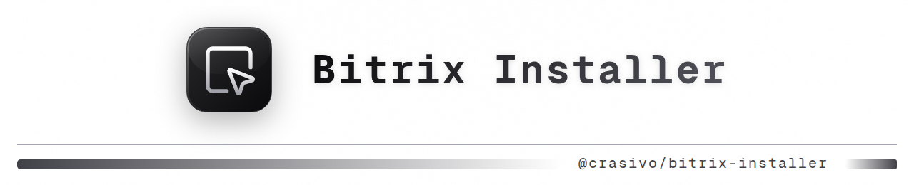

<center></center>

[](LICENSE)
[](composer.json)
[](composer.json)

A lightweight Composer skeleton/adapter designed to quickly prepare a clean environment for **1C-Bitrix** installation
with public directory isolation.

---

## 🎯 Goal & Core Idea

This project is not a pre-packaged CMS installation. It is a minimalist adapter that prepares the target workspace and
dynamically downloads the official vendor scripts (`bitrixsetup.php`, `restore.php`, `bitrix_server_test.php`) during
`composer create-project`.

### Key Design Decisions:

* **Directory Isolation**: Prepared for a secure structure where the web server root points to a `public/` directory,
  isolating code files like `vendor/` and configuration files from the public web space.
* **Step Selection**: Interactive placeholder located at `public/index.html` (site root) to guide you through the next
  setup steps.
* **Zero Bloat**: Intentionally contains zero third-party Composer packages (like Symfony components, PSR libraries,
  ORMs). The project remains extremely lightweight and only checks for PHP version and required extensions.
* **Dynamic Loading**: No CMS source code is stored in this repository. Everything is fetched securely at install time
  via Composer's `post-create-project-cmd` hooks.

---

## 🚀 Quick Start

To initialize a new Bitrix environment, run the standard Composer command:

```bash
composer create-project crasivo/bitrix-installer my-bitrix-site
```

### What Happens Under the Hood:

1. Composer verifies that your environment meets the minimum PHP version and extension requirements.
2. An isolated `public/` directory (DOCUMENT_ROOT) is created.
3. The interactive placeholder `index.html` is copied to `public/`.
4. The official installer scripts are dynamically downloaded into `public/`:

* `bitrixsetup.php` -> official CMS installation wizard.
* `restore.php` -> backup restoration wizard.
* `bitrix_server_test.php` -> server requirements checking tool.
* `bitrixsetup.debug` & `restore.debug` -> debug files to authorize scripts.
* `phpinfo.php` & `robots.txt` -> utility configuration files.

After the installation is complete, point your web server `DOCUMENT_ROOT` to the `public/` folder and open your website
in your browser to choose the next step.

---

## 📄 License

This project is open-source and licensed under the [MIT License](LICENSE).
